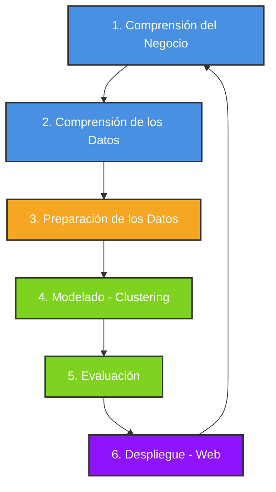

# 🚗 Análisis y Agrupamiento de Robos y Recuperos de Vehículos en Argentina
### Trabajo Final Integrador (2026) — Fundamentos de Ciencia de Datos (UNSL)

---

[](https://www.python.org/)
[](https://pandas.pydata.org/)
[](https://scikit-learn.org/)
[](https://en.wikipedia.org/wiki/Cross-industry_standard_process_for_data_mining)

Este proyecto desarrolla un análisis exhaustivo y un modelo de agrupamiento (**Clustering**) sobre las denuncias de robos y recuperos de vehículos registrados por la **Dirección Nacional de los Registros Nacionales de la Propiedad del Automotor (DNRPA)** en Argentina en el rango temporal 2020-2026, enfocado en evaluar la eficiencia del recupero a nivel geográfico y temporal.

---

## 📂 Estructura del Proyecto

El proyecto está organizado siguiendo las mejores prácticas para estructurar repositorios de ciencia de datos reproducibles y escalables:

```text
Trabajo Integrador/
├── data/
│   ├── raw/                  # Datasets originales mensuales de la DNRPA (por año)
│   └── processed/            # Dataset consolidado, sanitizado y unificado
│       └── dataset_consolidado.csv
├── scripts/
│   └── unificar_datos.py     # Script portable de preprocesamiento, limpieza y unificación
├── reports/
│   ├── limpieza_y_preparacion_datos.md  # Justificación teórica de sanitización y outliers
│   └── reporte_procesamiento.md         # Indicadores clave resultantes (comprensión)
├── requirements.txt          # Dependencias y librerías del proyecto
├── .gitignore                # Reglas para evitar subir archivos masivos a la web
├── resumen_procesamiento.txt # Reporte analítico condensado autogenerado por el script
├── Trabajo Final Integrador - Cs. Datos.docx  # Reporte principal académico
└── Trabajo Final Integrador 2026.pdf          # Consigna académica del proyecto
```

---

## 🛠️ Metodología CRISP-DM

El proyecto se estructura rigurosamente en torno al ciclo de vida estándar de la minería de datos **CRISP-DM**:



### 1. Comprensión del Negocio
* **Objetivo**: Evaluar e identificar perfiles regionales y temporales de delincuencia automotor y eficiencia en la recuperación de vehículos en Argentina.
* **Métrica Principal**: **Tasa de Recupero** `(Comunicaciones de Recupero / Denuncias de Robo) * 100`.

### 2. Comprensión de los Datos
* Exploración de 25 atributos provistos por la DNRPA.
* Identificación de inconsistencias severas en las cargas manuales, incluyendo nulos y valores atípicos (outliers) extremos.

### 3. Preparación de los Datos (Sanitización y Limpieza)
Implementado de forma 100% reproducible y dinámica en el script `unificar_datos.py`:
* **Deduplicación**: Eliminación física de registros duplicados exactos.
* **Reducción de Colinealidad**: Remoción de columnas ID numéricas redundantes (`titular_domicilio_provincia_id` y `titular_pais_nacimiento_id`).
* **Tratamiento de Outliers (Capping por Mediana)**:
  * Año de Modelo (`automotor_anio_modelo`) acotado al rango lógico `[1960, 2027]`.
  * Año de Nacimiento del Titular (`titular_anio_nacimiento`) acotado al rango biológico y legal lógico `[1920, 2009]`.
  * Porcentaje de Titularidad acotado estrictamente a `[0.0, 100.0]`.
* **Formateo Estricto**:
  * Fechas normalizadas al estándar universal `AAAA-MM-DD`.
  * Estandarización de textos a mayúsculas, quitando espacios excedentes.
  * Enteros nulos casteados a tipo `Int64` nullable para evitar que Pandas los convierta a float (`.0`).
  * Estructuración del CSV con comillas dobles (`""`) exclusivamente en campos de texto y sin comillas en datos numéricos.

---

## 📈 Hallazgos e Indicadores Clave (Dataset de Control 2023)

| Indicador | Valor | Descripción / Jurisdicción Destacada |
| :--- | :---: | :--- |
| **Registros Sanitizados Únicos** | **45.963** | Cantidad de trámites listos para modelar tras deduplicar. |
| **Volumen de Robos** | **44.608** | Denuncias de robo o hurto totales. |
| **Volumen de Recuperos** | **1.355** | Comunicaciones de recupero totales. |
| **Tasa de Recupero Nacional** | **3,0376%** | Promedio de eficiencia de recuperación en el país. |
| **Mayor Eficiencia Regional** | **26,40%** | **ENTRE RÍOS** (125 robos, 33 recuperos). |
| **Menor Eficiencia Regional** | **0,00%** | **LA RIOJA** (13 robos) y **TIERRA DEL FUEGO** (22 robos). |
| **Concentración del Delito** | **67,8%** | **PROVINCIA DE BUENOS AIRES** (30.258 robos, Tasa de recupero: 1,74%). |
| **Jurisdicción Local (San Luis)** | **2,8986%** | **SAN LUIS** (69 robos, 2 recuperos). |

---

## ⚡ Guía de Inicio Rápido

Sigue estos pasos para clonar, configurar y ejecutar el procesamiento de datos de forma local:

### 1. Requisitos Previos
Asegúrate de tener instalado Python (versión 3.8 o superior).

### 2. Instalar Dependencias
Instala los paquetes necesarios utilizando el archivo de requerimientos:
```bash
pip install -r requirements.txt
```

### 3. Organizar los Datos
Asegúrate de que tus archivos CSV mensuales originales de la DNRPA estén colocados dentro del directorio de entrada de datos crudos:
`data/raw/dataset-dnrpa-robos-recuperos-autos/` (el script buscará automáticamente de forma recursiva).

### 4. Ejecutar el Pipeline de Procesamiento
Ejecuta el script unificador desde la terminal:
```bash
python scripts/unificar_datos.py
```

El script imprimirá en pantalla las estadísticas de carga, ejecutará la limpieza y guardará:
1. El dataset procesado final en `data/processed/dataset_consolidado.csv`.
2. Un reporte resumido actualizado en `resumen_procesamiento.txt`.

---

## 🎓 Autores
* **Ezequiel Bernaldez**
* **Ezequiel Nodar**

*Universidad Nacional de San Luis (UNSL) — Facultad de Ciencias Físico Matemáticas y Naturales.*
